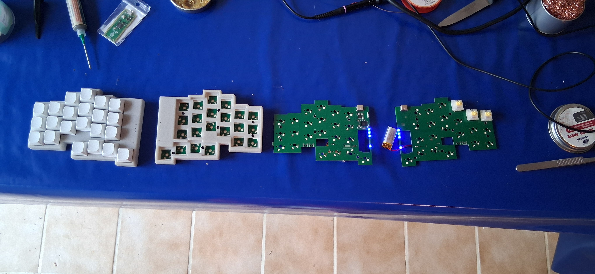
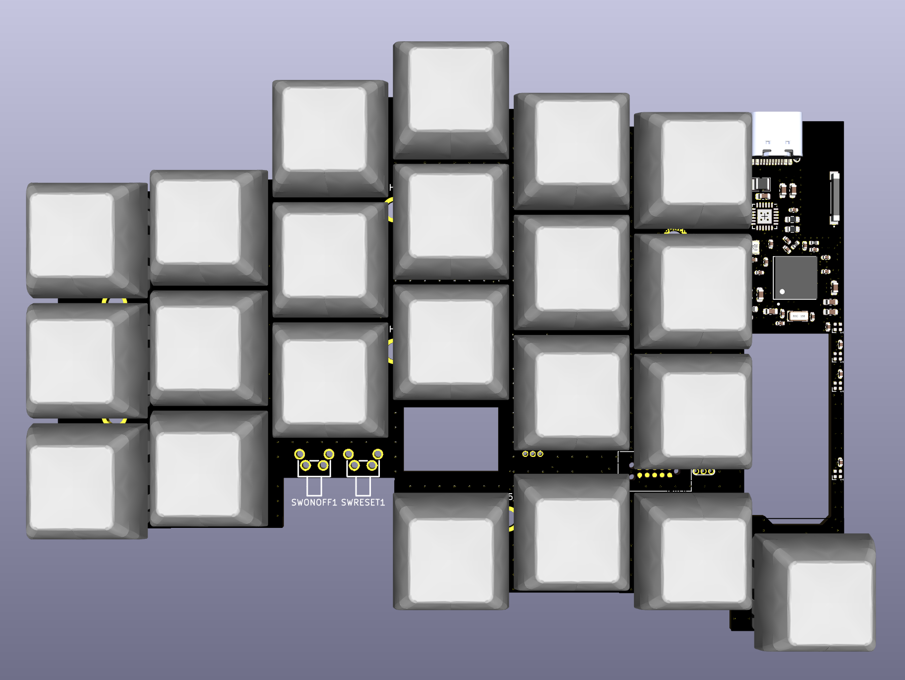
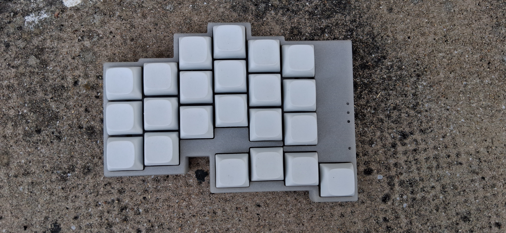
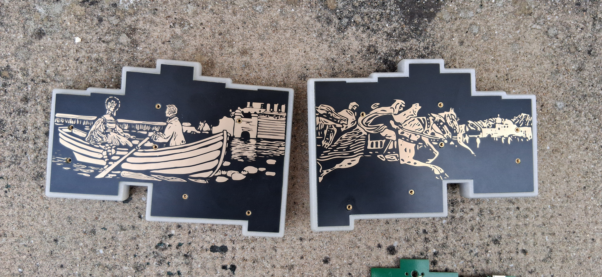
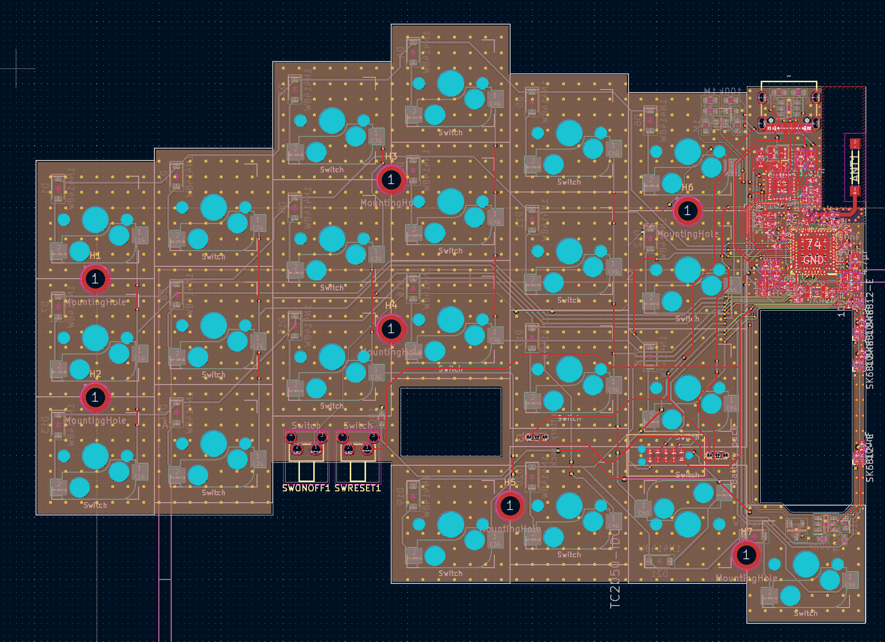
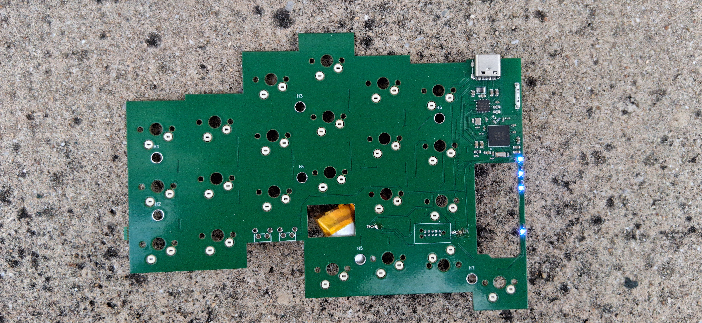

# CHANTIER
Le clavier est entièrement fonctionnel. Le firmware et la coque doivent encore être ajustés. 

-

# ITEMX3
ITEMX3 est un clavier ergonomique en deux parties de 44 touches fonctionnant avec deux nRF52840 et Zephyr. Il est basé sur une disposition dérivée du BÉPO. 

Pour plus de détails sur le projet, voir ici et ici :
[ITEMX](https://github.com/MartinDrillon/ITEMX)
[ITEMX2](https://github.com/MartinDrillon/zmk-config-itemMXdeux)

-

